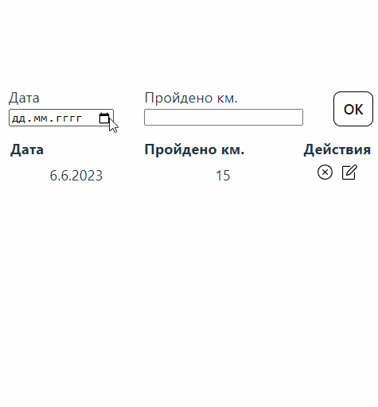

## Card react-bootstrap

 

Реализовано небольшое приложение, которое хранит данные о тренировках и прогулках, которые Вы совершаете.

 

 

В форме ввода необходимо указать дату тренировки и пройденной расстояние в км., при отправке формы данные добавляются в таблицу.

-   Новые значения сортируются по дате. Более новая дата тренировки встает в начало таблицы
-   Если добавляется тренировка с уже существующей датой, то значения суммируются
-   С помощью ✘ можно удалить данные о тренировке
-   Отредактировать расстояние тренировки можно в модальном окне, с помощью иконки 🖊